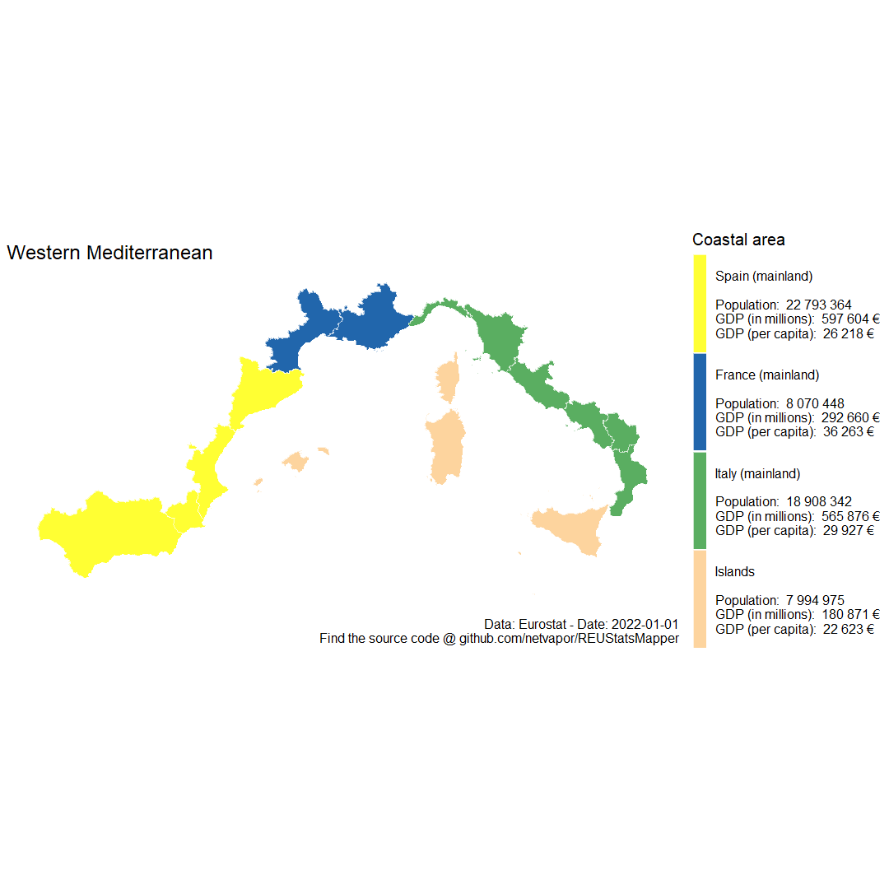

# EUStatsMapper
With this R script arbitrary geographical groups based on the NUTS 2 or NUTS 3 regions can be charted on a map.  
It also aggregates total population, GDP and GDP per capita for these groups.  

Input jsons can be easily generated by using mapchart.net and then saving the map configuration:    
- https://mapchart.net/europe-nuts2.html  
- https://mapchart.net/europe-nuts3.html  
⚠️ Make sure to also name the regions you color in the text boxes below the chart.  

You can configure an analysis by modifying the config.yml before running the script:

```
# Path to the input json
input_file_path: "mapchartSave__europe_nuts3__.txt"

# Chart title
chart_title: "Hypothetical division of Germany into eight federal states"

# Label for the type of geographical group
group_type: "Federal State"

# Year for which the data is shown in the format "2018-01-01", "auto-select" picks the most recent year
# (default: "auto-select")
data_of_year: "auto-select" 

# Output chart dimensions (default: [1080, 1080])
chart_size: [1080, 1080]

# Output chart text size (default: 20)
text_size: 20

# Output chart path, e.g.: "/charts/map". Chart format is .png and automatically appended.
# Default: Working directory/"chart"
output_file_path: 
```

Example charts:
  


